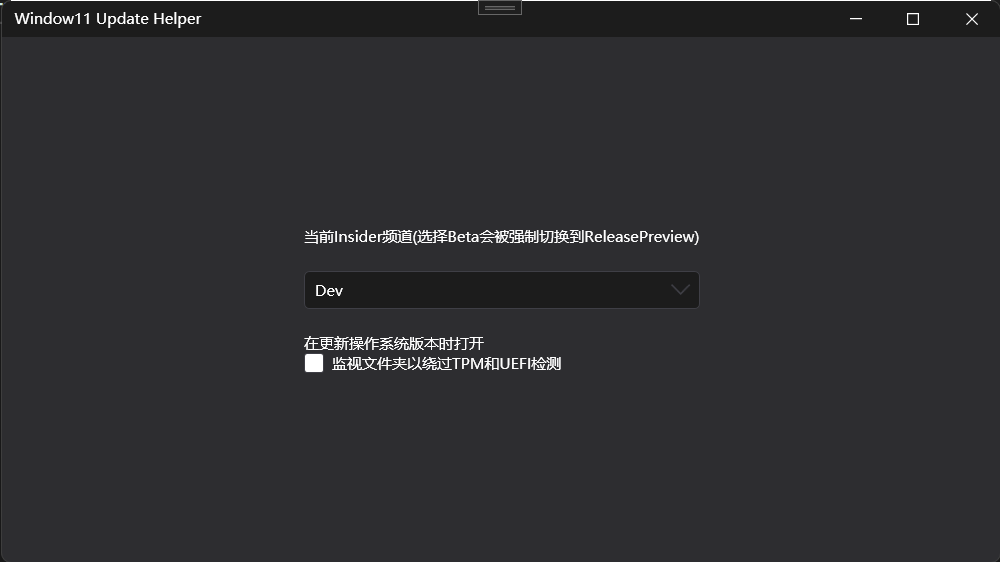
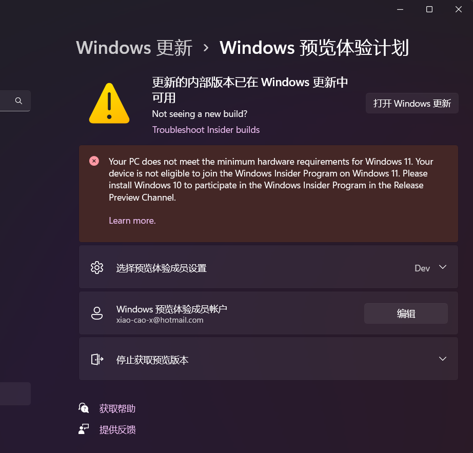

# Windows11更新助手

## 用于没有TPM和UEFI的老主板更新Windows11

+ 切换Insider频道
+ 监视文件夹自动修改文件来跳过TPM和UEFI检测

## 预览

## 注意

1. 在下载8%之前启用`监视文件夹以绕过TPM和UEFI检测`功能
2. 下载到9%的时候就可以关掉了(因为他只会在8%的时候检测)
3. `Beta`频道不可用,会被强制切换到`ReleasePreview`